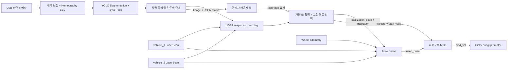

# PINKK Smart Parking System

상단 카메라와 차량별 LiDAR를 이용해 두 대의 Pinky Pro를 식별하고, 주차 공간을
배정한 뒤 사전 검증된 경로와 MPC로 입차·충전·출차를 수행하는 ROS 2 기반 스마트
주차 프로젝트입니다.

## 주요 모듈

- `src/robot_arm`: 로봇팔 카메라, 동작 제어 및 설정
- `src/central_control`: 상단 카메라, BEV, 지도, 경로 계획, 모델, 시스템 통합 및 설정
- `src/vehicle_control`: 차량 제어 코드 및 설정
- `ros2_ws/src/pinkk_usb_insertion`: USB-A 포트 인식, 접근, 정렬 및 삽입 제어
- `ros2_ws/src/pinkk_usb_insertion_interfaces`: YOLO keypoint와 포트 관측 ROS 메시지

로봇팔 USB 정렬 제어의 실행 방법은
[`pinkk_usb_insertion/README.md`](ros2_ws/src/pinkk_usb_insertion/README.md)를
참고하세요. 캘리브레이션 패키지와 실제 운용 제어 패키지는 분리해서 관리합니다.
현재 완료된 기능, 문제와 다음 계획은
[`USB 포트 정렬 개발일지`](ros2_ws/src/pinkk_usb_insertion/docs/DEVELOPMENT_LOG_KO.md)에서
관리합니다.

프로젝트 루트에는 안내 문서인 `README.md`와 라이브러리 의존성 파일인
`requirements.txt`만 두고, 실행 코드와 데이터는 위 세 영역 안에서 관리합니다.

## 설치
이 문서의 모든 로컬 명령은 **저장소 루트**에서 실행합니다. 저장소 설치 위치에
관계없이 다음 명령으로 루트로 이동할 수 있습니다.

```bash
cd "$(git rev-parse --show-toplevel)"
```

## 1. 프로젝트 목표와 현재 범위

최종 목표는 다음과 같습니다.

1. 상단 카메라 한 대로 주차장 전체와 여러 차량을 실시간 관측합니다.
2. 차량별 LiDAR와 카메라 track을 결합해 `vehicle_1`, `vehicle_2`를 혼동하지 않습니다.
3. 빈 주차면·충전면과 현재 운행 단계를 기준으로 목적지를 자동 배정합니다.
4. 검증된 전진/후진 경로를 차량별 ROS namespace로 전달합니다.
5. 카메라 위치, wheel odometry, LiDAR map heading을 융합해 차량 pose를 만듭니다.
6. 차동구동 MPC가 경로를 추종하고 장애물·통신 단절·제어 충돌 시 정지합니다.
7. 관리자/사용자 웹에서 상태, 영상, 배터리, 입출차 요청과 긴급정지를 처리합니다.

현재 구현 상태는 다음과 같습니다.

| 영역 | 상태 | 설명 |
|---|---|---|
| 상단 카메라 위치추정 | 구현 | 보정, BEV, YOLO segmentation, ByteTrack, 주차면 점유 판정 |
| 다중 차량 식별 | 구현 | 차량별 LaserScan과 camera track의 LiDAR map 정합 |
| 실시간 운영 경로 | 구현 | 26개 고정 mission route 선택·발행 |
| 차량 pose 융합 | 구현 | 카메라 x/y + odom 상대 yaw + LiDAR map 절대 보정 |
| 차량 제어 | 구현 | SLSQP 기반 차동구동 MPC와 fail-closed 안전정지 |
| 관리자 웹 | 구현 | 영상·상태·배터리·경로 요청·긴급정지 |
| 사용자 웹 | 시험 구현 | 입차/출차 요청, 배터리, BEV 스트림 |
| 온라인 Hybrid A* | 진단용 | 운영 중에는 탐색하지 않고 고정 경로를 사용 |
| 로봇팔 | 골격만 존재 | 설정과 디렉터리만 있으며 동작 파이프라인은 미구현 |
| 통합 명령 중재기 | 일부 구현 | `entry/exit/charge/park/replan` 경로 요청 처리, 별도 이벤트 노드는 미완성 |

## 2. 전체 구조와 데이터 흐름



주요 디렉터리입니다.

| 경로 | 역할 |
|---|---|
| `src/central_control/overhead_vision` | 카메라, BEV, 검출, 위치추정, ROS 발행 |
| `src/central_control/path_planning` | 고정 경로, Hybrid A*, Reeds–Shepp, 검증 도구 |
| `src/central_control/parking_management_web` | 관리자 정적 웹 |
| `src/central_control/parking_user_web` | 사용자 Flask 시험 웹 |
| `src/vehicle_control` | pose 융합, MPC, Pinky 상태 LED/LCD, 실행 스크립트 |
| `src/robot_arm` | 향후 로봇팔 기능을 위한 골격 |
| `src/central_control/config` | 차량 레지스트리, 카메라, 지도, YOLO 설정 |
| `src/vehicle_control/config` | pose 융합과 MPC 설정 |

## 3. 사용 알고리즘

### 3.1 영상 보정과 좌표 변환

1. 카메라 내부 파라미터와 왜곡 계수로 원본 영상을 보정합니다.
2. `bev_homography.npz`의 homography로 영상을 `1600×800` Camera BEV로 변환합니다.
3. `camera_to_lidar_rigid_registration.npz`의 affine/rigid registration으로
   Camera BEV 좌표를 `lidar_map_cm` 좌표로 변환합니다.
4. 위치·경로·MPC 입력은 모두 **차량 중심**, m 단위, `lidar_map` frame으로 통일합니다.

### 3.2 차량 검출, 추적과 주차면 점유

- `best.pt`의 YOLO segmentation mask를 사용합니다. detection box만 있는 모델은
  차량 장축과 공간 겹침 계산에 사용할 수 없습니다.
- Ultralytics ByteTrack이 프레임 사이 `track_id`를 유지합니다.
- confidence는 공간 점유 후보와 제어용 ego 후보에 서로 다른 임계값을 적용합니다.
- 고정 주차 polygon과 차량 mask의 겹침 비율이 `occupancy_threshold` 이상이면
  점유로 판정합니다.
- 차량 중심과 yaw에는 지수 저역통과 필터를 적용하고, 큰 위치 점프와 오래된
  track은 거부합니다.

관련 설정: `src/central_control/config/yolo/realtime_localization.yaml`

### 3.3 차량 ID 자동 연결

카메라의 일시적인 `track_id`를 영속적인 `vehicle_1/vehicle_2`에 연결하기 위해
각 차량의 LaserScan을 사용합니다.

1. LaserScan endpoint를 LiDAR 장착 방향에 맞춰 차량 좌표로 변환합니다.
2. 점유 지도에 distance transform을 만들어 scan endpoint와 벽 사이 평균 거리를
   정합 점수로 사용합니다. 이상치 영향을 줄이기 위해 가까운 70%의 trimmed mean을
   사용합니다.
3. 각 camera track 중심 주변 ±25 cm에서 x/y/yaw를 coarse-to-fine 탐색합니다.
4. 두 차량과 두 track의 가능한 일대일 순열을 비교해 총 비용이 가장 낮은 조합을
   선택합니다.
5. 1·2순위 비용 margin, 최대 정합 오차, 2회 연속 확인을 모두 통과해야 확정합니다.
6. 확정 전에는 잘못된 차량을 움직이지 않도록 pose와 trajectory를 발행하지 않습니다.

구현: `src/central_control/overhead_vision/path_planning/lidar_vehicle_association.py`,
`src/vehicle_control/heading_fusion.py`

### 3.4 운영 경로 계획

실시간 운행은 온라인 Hybrid A*가 아니라 **사전 생성·검증된 고정 경로**를
사용합니다. 현재 manifest에는 26개 경로가 있습니다.

- `START → P5~P8, C1, C2`
- `P5~P8 → C1, C2`
- `C1, C2 → P1~P4`
- `P1~P4 → EXIT`

경로는 직선, 원호, Bezier, 방향 제한 Reeds–Shepp 연결과 전용 주차 maneuver를
조합하며 0.5 cm 간격의 차량 중심 pose로 저장됩니다. 각 점의 필드는
`x_cm, y_cm, yaw_rad, direction`이고 `direction`은 전진 `1`, 후진 `-1`입니다.

경로 선택기는 현재 차량이 `START` 또는 어느 주차면에 있는지 판정하고 허용된
source/target CSV 전체를 선택합니다. 주행 중 `TRANSIT` 상태에서는 경로를 중간부터
잘라 다시 만들지 않습니다.

### 3.5 오프라인 Hybrid A* 계열

다음 알고리즘은 지도나 경로 형상 변경 시 실험·회귀 진단에 사용하며 현재 실시간
운영 루프에는 직접 들어가지 않습니다.

- SE(2) 상태의 Hybrid A*: x/y/yaw/조향 상태와 전후진 motion primitive 탐색
- obstacle-aware holonomic cost-to-go heuristic
- 차량 회전 footprint 충돌 검사
- 목표 근처 Reeds–Shepp analytic expansion
- 조향·조향 변화·후진·기어 전환 penalty
- knot 기반 smoothing과 0.5 cm 재샘플링
- 곡률 기반 속도 profile, 가감속 제한, cusp 필수 정지
- 수치·곡률·속도·조향 변화·충돌을 검사하는 fail-closed trajectory validator

설정: `src/central_control/path_planning/config/planner_config.yaml`

### 3.6 Pose 융합

`fused_pose_estimator`는 현재 설정에서 IMU를 쓰지 않고 다음 신호를 결합합니다.

- 카메라 차량 중심 x/y: 절대 위치, EMA 필터 적용
- wheel odometry: 카메라 프레임 사이 상대 이동과 상대 yaw
- LiDAR scan-map matching: 절대 yaw 초기화와 제한적 drift 보정
- 고정 경로 첫 yaw: 출발점에서 odom-map yaw 기준을 잡는 prior
- 실제 `cmd_vel` 방향: 전진/후진 이동 heading 판정

카메라 촬영·필터 지연 동안의 odom 이동량을 x/y에 보상하며, 위치·odom·scan이
timeout되거나 정합 점수가 나쁘면 pose를 발행하지 않습니다.

설정: `src/vehicle_control/config/localization/fused_pose.yaml`

### 3.7 차동구동 MPC

`DifferentialDriveMpc`는 예측 horizon의 signed speed와 curvature를 SciPy SLSQP로
최적화합니다.

- 차동구동 rear-axle 운동학과 차량 중심 control point offset 사용
- 위치, yaw, 목표 속도, 경로 곡률, 속도 변화, 곡률 변화 비용
- 전진 시 경로 접선 기준 종·횡오차 분리
- 후진/전진 direction block과 cusp 정지 관리
- warm start와 동일 경로 재발행 시 progress 보존
- 휠 속도, 선속도, 각속도, 가속도, 곡률과 곡률 변화 제한
- `angular.z = speed × curvature × angular_command_sign`

안전 게이트는 pose/path/scan timeout, invalid scan sector, 진행 방향 장애물,
비정상 trajectory, solver 실패, 큰 heading 오차, 다른 `cmd_vel` publisher를 감지하면
0속도를 발행합니다.

설정: `src/vehicle_control/config/mpc/mpc.yaml`

## 4. 통신 방식

### 4.1 ROS 2와 네트워크

- 중앙 PC와 Pinky는 ROS 2 Jazzy, 같은 `ROS_DOMAIN_ID=36`, 같은 LAN을 사용합니다.
- ROS 2 middleware는 DDS이며 Pinky 실행 스크립트는 Fast DDS의 `UDPv4` transport를
  명시합니다.
- 차량은 `/pinkk/vehicle_1`, `/pinkk/vehicle_2` namespace로 완전히 분리합니다.
- 원격 배포와 bringup 시작/종료에는 SSH와 SCP를 사용합니다.
- 별도의 MQTT나 자체 UDP/TCP protocol은 사용하지 않습니다.

### 4.2 웹 통신

| 용도 | 방식 | 기본 포트 |
|---|---|---:|
| 관리자 HTML/API | HTTP | 8000 |
| ROS 영상 스트림 | `web_video_server`의 HTTP MJPEG | 8080 |
| 브라우저↔ROS | rosbridge WebSocket(JSON) | 9090 |
| 사용자 시험 웹 | Flask HTTP | 5002 |
| Pinky 원격 제어 | SSH/SCP | 22 |

관리자 웹은 `cmd_vel`을 직접 발행하지 않습니다. 일반 요청은
`/pinkk/web/control`의 JSON 문자열로 보내고, 긴급정지는 차량별
`set_emergency_stop` 서비스를 직접 호출해 0속도를 래치합니다.

### 4.3 핵심 ROS interface

`N`은 `1` 또는 `2`입니다.

| 이름 | 타입 | 방향/역할 | QoS 핵심 |
|---|---|---|---|
| `/pinkk/vehicle_N/scan` | `sensor_msgs/LaserScan` | Pinky → 식별·융합·안전정지 | sensor/best effort |
| `/pinkk/vehicle_N/odom` | `nav_msgs/Odometry` | Pinky → pose 융합 | best effort |
| `/pinkk/vehicle_N/localization_pose` | `geometry_msgs/PoseStamped` | 카메라 → pose 융합 | reliable |
| `/pinkk/vehicle_N/fused_pose` | `geometry_msgs/PoseStamped` | 융합 → MPC | reliable |
| `/pinkk/vehicle_N/path` | `nav_msgs/Path` | 중앙제어 시각화 | reliable, transient local |
| `/pinkk/vehicle_N/trajectory` | `std_msgs/Float64MultiArray` | 중앙제어 → 융합/MPC | reliable, transient local |
| `/pinkk/vehicle_N/path_valid` | `std_msgs/Bool` | 경로 폐기·정지 | reliable, transient local |
| `/pinkk/vehicle_N/cmd_vel` | `geometry_msgs/Twist` | MPC → 모터 | depth 10 |
| `/pinkk/vehicle_N/heading_diagnostics` | `std_msgs/Float64MultiArray` | 융합 진단 | depth 10 |
| `/pinkk/vehicle_N/battery/*` | `std_msgs/Float32` | Pinky → 웹/LED/LCD | depth 10 |
| `/pinkk/vehicle_N/lcd_status` | `std_msgs/String` | 웹 → LED/LCD | depth 10 |
| `/pinkk/vehicle_N/emergency_stop_state` | `std_msgs/Bool` | 긴급정지 래치 상태 | reliable, transient local |
| `/pinkk/vehicle_N/set_emergency_stop` | `std_srvs/SetBool` | 긴급정지 설정/해제 | service |
| `/pinkk/web/control` | `std_msgs/String` | 웹 → 중앙 경로 요청 | reliable |
| `/pinkk/management/status` | `std_msgs/String` | 중앙 → 관리자 웹 JSON | reliable |
| `/pinkk/localization/image` | `sensor_msgs/Image` | YOLO annotation 영상 | reliable |
| `/pinkk/lidar_map/image` | `sensor_msgs/Image` | LiDAR map overlay 영상 | reliable |
| `/pinkk/camera_bev/image` | `sensor_msgs/Image` | 사용자 웹용 순수 Camera BEV | reliable |

trajectory의 layout은 point × field이고 field 순서는 정확히 다음과 같습니다.

```text
x_m, y_m, yaw_rad, direction
```

## 5. 상대 경로 원칙

- 로컬 명령과 YAML 경로는 저장소 루트 기준 상대 경로를 사용합니다.
- Python 영상 파이프라인은 `Path(__file__)`에서 저장소 루트를 계산합니다.
- 실행 shell은 `${BASH_SOURCE[0]}`에서 프로젝트 루트를 계산하므로 다른 현재
  디렉터리에서 호출해도 됩니다.
- 차량 제어 스크립트는 map과 MPC tuning 경로를 절대 경로 parameter로 변환해
  노드에 전달합니다.
- MPC 단독 실행에서도 현재 위치, 소스 저장소, ROS package share 순으로 tuning
  파일을 탐색합니다.
- `/home/pinky/...`와 `~/pinky_pro/...`는 로컬 저장소 경로가 아니라 Pinky 원격
  장치의 배포/설치 위치이므로 유지합니다.

## 6. 실행 전 환경 구성

### 6.1 기준 환경

- Ubuntu 24.04
- ROS 2 Jazzy
- Python 3.12
- 중앙 PC와 Pinky가 같은 LAN
- PINKY_01 기본 주소 `pinky@192.168.0.4`
- PINKY_02 기본 주소 `pinky@192.168.0.5`
- ROS domain `36`

ROS 2 Jazzy가 이미 설치됐다는 전제에서 중앙 PC 도구를 설치합니다.

```bash
sudo apt update
sudo apt install -y \
  python3-venv python3-pip python3-colcon-common-extensions v4l-utils \
  ros-jazzy-web-video-server ros-jazzy-rosbridge-server
```

### 6.2 Python 가상환경

`rclpy`는 ROS의 system Python package이므로 반드시
`--system-site-packages`를 사용합니다.

```bash
source /opt/ros/jazzy/setup.bash
python3 -m venv --system-site-packages .venv
.venv/bin/python -m pip install --upgrade pip
.venv/bin/python -m pip install -r requirements-vision.txt
```

NVIDIA GPU를 전혀 사용하지 않는 PC에서만 CPU 전용 PyTorch를 설치합니다.

```bash
.venv/bin/python -m pip install -r requirements-vision-cpu.txt
```

CUDA PC에서는 `requirements-vision-cpu.txt`를 설치하지 않습니다. 현재 PC에서
검증된 조합은 PyTorch `2.13.0+cu130`, NVIDIA driver `595.71.05`입니다.

### 6.3 모델·보정·지도 필수 파일

다음 파일이 있어야 실시간 localization이 시작됩니다.

```text
src/central_control/models/best.pt
src/central_control/camera_tools/first_map/camera_calibration.npz
src/central_control/camera_tools/first_map/bev_homography.npz
src/central_control/camera_tools/first_map/camera_to_lidar_rigid_registration.npz
src/central_control/camera_tools/first_map/my_test_map0710.png
src/central_control/path_planning/output/fixed_route_manifest.csv
```

### 6.4 카메라와 CUDA 설정

카메라 번호를 확인합니다.

```bash
v4l2-ctl --list-devices
v4l2-ctl --device /dev/video2 --list-formats-ext
```

실시간 설정은
`src/central_control/config/yolo/realtime_localization.yaml`에서 변경합니다.

```yaml
camera_id: 2
camera_width: 1920
camera_height: 1080
camera_fps: 30
inference_imgsz: 1600
inference_device: 0       # 첫 NVIDIA GPU
```

CPU fallback은 `inference_device: cpu`로 설정합니다. CPU에서도 YOLO는 동작하지만
Large segmentation과 1600 입력은 실시간 처리에 부적합할 수 있습니다.

CUDA 확인:

```bash
nvidia-smi
.venv/bin/python -c \
  "import torch; print(torch.cuda.is_available(), torch.cuda.get_device_name(0))"
```

드라이버 모듈은 로드됐지만 `/dev/nvidia*`가 없을 때는 다음을 실행합니다.

```bash
sudo apt install nvidia-modprobe
sudo nvidia-modprobe -u -c=0
nvidia-smi
```

### 6.5 ROS 빌드

```bash
source /opt/ros/jazzy/setup.bash
colcon build --symlink-install
source install/setup.bash
```

현재 유효한 ROS 실행 항목은 다음과 같습니다.

```text
fused_pose_estimator
mpc_path_follower
pinky_status_led
pinky_status_lcd
trajectory_publisher
vehicle_pose_publisher
```

### 6.6 사전 점검

```bash
./src/central_control/scripts/check_environment.sh
```

`errors=0`이어야 합니다. CUDA를 의도적으로 쓰지 않으면 CUDA warning은 허용할 수
있습니다.

## 7. 권장 실행 순서

실차가 움직일 수 있으므로 최초 검증은 바퀴를 띄우거나 비상정지를 준비한 상태에서
진행합니다. 같은 차량의 다른 PID/Pure Pursuit/Stanley/lane controller는 반드시
종료합니다.

### 7.1 관제·localization·Pinky bringup 실행

최초 한 번은 SSH 키를 등록하면서 실행합니다.

```bash
export ROS_DOMAIN_ID=36
./src/central_control/scripts/run_parking_management.sh --setup-ssh
```

이후에는 다음 한 줄을 사용합니다.

```bash
./src/central_control/scripts/run_parking_management.sh
```

이 스크립트가 시작하는 항목:

- `web_video_server` : 8080
- `rosbridge_websocket` : 9090
- 관리자 정적 웹/API : 8000
- 사용자 Flask 웹 : 5002
- YOLO localization과 고정 경로 발행
- 두 Pinky의 remote bringup, 상태 LED와 LCD

관리자 웹은 `http://<ROS_PC_IP>:8000`, 사용자 웹은
`http://<ROS_PC_IP>:5002/?robot=1`(또는 `robot=2`)입니다. 사용자 웹 영상은
`/pinkk/camera_bev/image`만 사용하므로 YOLO 검출, 차량 좌표와 생성 경로가
그려지지 않습니다. 로그는
`.runtime/parking_management/`에 저장됩니다. `Ctrl+C`로 이 스크립트가 시작한
관제와 원격 서비스를 함께 종료합니다.

Pinky 없이 중앙 PC만 시험:

```bash
./src/central_control/scripts/run_parking_management.sh --without-pinky
```

카메라 없이 웹·Pinky·긴급정지만 시험:

```bash
./src/central_control/scripts/run_parking_management.sh --without-camera
```

주소를 바꿀 때:

```bash
PINKY1_HOST=pinky@192.168.0.99 \
PINKY2_HOST=pinky@192.168.0.103 \
./src/central_control/scripts/run_parking_management.sh
```

### 7.2 차량별 pose 융합과 MPC 실행

관제 실행 스크립트는 안전상 중앙 PC의 MPC를 자동 시작하지 않습니다. 새 터미널을
열어 차량별로 명시적으로 실행합니다.

터미널 1:

```bash
export ROS_DOMAIN_ID=36
./src/vehicle_control/run_vehicle_controller.sh vehicle_1
```

터미널 2:

```bash
export ROS_DOMAIN_ID=36
./src/vehicle_control/run_vehicle_controller.sh vehicle_2
```

### 7.3 do-mpc 실시간 시각화

MPC 제어기를 먼저 실행한 뒤 별도 터미널에서 같은 차량 ID로 실행합니다.
시각화 노드는 제어 명령을 발행하지 않으므로 닫아도 차량 주행에는 영향을 주지
않습니다.

```bash
cd ~/PINKK
./src/vehicle_control/run_mpc_visualizer.sh vehicle_1
```

화면에는 전체 경로, 현재 차량 중심, 최적화된 미래 horizon, reference horizon,
선속도·각속도·곡률, 횡오차·헤딩오차, 속도·곡률·각속도·계산시간 제약 사용률이
실시간으로 표시됩니다. `vehicle_2`는 마지막 인자만 바꿉니다.

각 스크립트는 동일 namespace에서 `fused_pose_estimator`와
`mpc_path_follower`를 함께 실행하고 하나가 종료되면 다른 하나도 정리합니다.

### 7.4 사용자 웹 개별 실행

통합 스크립트는 사용자 웹도 자동 실행합니다. 사용자 웹만 따로 실행해야 할 때는
`web_video_server`와 localization을 먼저 실행한 뒤 아래 명령을 사용합니다.

```bash
source /opt/ros/jazzy/setup.bash
source install/setup.bash
export ROS_DOMAIN_ID=36
.venv/bin/python \
  src/central_control/parking_user_web/app_user_parking_coordinate_test.py
```

- 차량 1: `http://<ROS_PC_IP>:5002/?robot=1`
- 차량 2: `http://<ROS_PC_IP>:5002/?robot=2`

기본 영상 토픽은 순수 BEV `/pinkk/camera_bev/image`이며, 사용자 웹 프로세스는
USB 카메라를 직접 열지 않습니다.

### 7.5 localization만 실행

```bash
source /opt/ros/jazzy/setup.bash
source install/setup.bash
export ROS_DOMAIN_ID=36
.venv/bin/python -m \
  src.central_control.overhead_vision.localization.live_localization
```

카메라 없이 저장된 BEV로 검사:

```bash
.venv/bin/python -m \
  src.central_control.overhead_vision.localization.live_localization \
  --bev-image src/central_control/camera_tools/first_map/camera_bev.png \
  --initial-ego-center 67 585 \
  --initial-yaw-deg -117 \
  --no-display
```

## 8. 개별 실행 명령

관제 구성요소를 각각 실행해야 할 때는 터미널마다 ROS 환경과 domain을 설정합니다.

```bash
source /opt/ros/jazzy/setup.bash
source install/setup.bash
export ROS_DOMAIN_ID=36
```

```bash
ros2 run web_video_server web_video_server
ros2 launch rosbridge_server rosbridge_websocket_launch.xml
python3 src/central_control/scripts/serve_parking_management.py \
  --port 8000 \
  --directory src/central_control/parking_management_web \
  --vehicle-config src/central_control/config/vehicles.yaml
```

차량 1 제어 노드 수동 실행:

```bash
ros2 run pinkk fused_pose_estimator \
  --ros-args \
  -r __ns:=/pinkk/vehicle_1 \
  --params-file src/vehicle_control/config/localization/fused_pose.yaml \
  -p map_image_path:="$(pwd)/src/central_control/camera_tools/first_map/my_test_map0710.png"

ros2 run pinkk mpc_path_follower \
  --ros-args \
  -r __ns:=/pinkk/vehicle_1 \
  --params-file src/vehicle_control/config/mpc/mpc.yaml \
  -p tuning_file:="$(pwd)/src/vehicle_control/config/mpc/mpc.yaml"
```

## 9. 검사와 경로 재생성

Python 문법 검사:

```bash
.venv/bin/python -m compileall -q src
```

차량 pose/heading 회귀 검사:

```bash
.venv/bin/python src/vehicle_control/tests/test_heading_fusion.py
```

MPC 전체 시뮬레이션:

```bash
.venv/bin/python src/vehicle_control/tests/test_mpc_controller.py
```

고정 경로를 파일 변경 없이 검사:

```bash
.venv/bin/python \
  src/central_control/path_planning/scripts/test_fixed_mission_routes.py \
  --check-all
.venv/bin/python \
  src/central_control/path_planning/scripts/test_fixed_route_selector.py
.venv/bin/python \
  src/central_control/path_planning/scripts/test_fixed_live_route_bridge.py
```

지도나 mission 설정을 변경한 경우에만 26개 CSV를 다시 생성합니다. 이 명령은 기존
경로 파일을 덮어씁니다.

```bash
.venv/bin/python \
  src/central_control/path_planning/scripts/test_fixed_mission_routes.py \
  --generate-all
```

BEV 녹화 프레임 추출:

```bash
.venv/bin/python \
  src/central_control/camera_tools/first_map/extract_bev_frames.py \
  --count 1500
```

## 10. 운용 진단과 긴급정지

토픽 확인:

```bash
ros2 topic list -t | sort
ros2 topic info -v /pinkk/vehicle_1/cmd_vel
ros2 topic info -v /pinkk/vehicle_2/cmd_vel
timeout 10 ros2 topic echo /pinkk/vehicle_1/fused_pose --once
timeout 10 ros2 topic echo /pinkk/vehicle_1/scan --once
```

MPC 실행 전 차량별 `cmd_vel` publisher는 0개, 실행 후에는 MPC 1개여야 합니다.
긴급정지가 래치되면 정지 노드가 추가 publisher로 0속도를 계속 발행하므로 예외입니다.

긴급정지:

```bash
ros2 service call /pinkk/vehicle_1/set_emergency_stop \
  std_srvs/srv/SetBool "{data: true}"
```

주변 안전을 확인한 뒤 해제:

```bash
ros2 service call /pinkk/vehicle_1/set_emergency_stop \
  std_srvs/srv/SetBool "{data: false}"
```

두 Pinky와 중앙 PC의 진단 수집:

```bash
./src/central_control/scripts/collect_pinky_diagnostics.sh
```

## 11. 주요 설정 파일

| 파일 | 변경 내용 |
|---|---|
| `src/central_control/config/vehicles.yaml` | 차량 ID, namespace, IP 대응 |
| `src/central_control/config/yolo/realtime_localization.yaml` | 카메라, GPU, YOLO, 추적, 배정, ROS 발행 |
| `src/central_control/path_planning/config/fixed_mission_routes.yaml` | endpoint와 허용 mission 전이 |
| `src/central_control/path_planning/config/planner_config.yaml` | Hybrid A*, profile, validator |
| `src/central_control/path_planning/config/vehicle_config.yaml` | 차량 footprint와 기구학 치수 |
| `src/vehicle_control/config/localization/fused_pose.yaml` | scan matching, odom, timeout, pose 융합 |
| `src/vehicle_control/config/mpc/mpc.yaml` | 속도·곡률·가중치·안전정지·튜닝 자동 반영 |

MPC YAML을 실행 중 저장하면 1초 안에 전체 값을 검증한 뒤 원자적으로 반영합니다.
범위를 벗어나면 변경 전체를 거부하고 이전 설정을 유지합니다. 토픽 이름과
`tuning_file` 같은 static parameter는 노드를 재시작해야 반영됩니다.

## 12. 현재 주의사항

- 실시간 경로는 고정 지도 전용입니다. 주차장 구조가 바뀌면 registration,
  parking polygon, endpoint와 모든 고정 경로를 다시 검증해야 합니다.
- 동적 장애물을 MPC 최적화 안에 넣지는 않습니다. 현재는 진행 방향 LaserScan
  sector의 비상정지로 처리합니다.
- 별도 management event publisher는 아직 구현되지 않았습니다.
- 사용자 웹은 운영 모드(`debug=False`)로 실행되지만 Flask 내장 서버이므로 외부
  인터넷에 직접 공개하지 않고 주차장 내부망에서 사용합니다.
- 로봇팔은 아직 실제 자동 주차 흐름에 연결되어 있지 않습니다.
- 현재 전체 MPC 회귀 검사는 직선에서 2 cm 횡이탈 후 합류할 때 중심선을 약
  6.2 mm 넘어가는 항목에서 실패합니다. 새 실차 주행 전 forward rejoin 튜닝 또는
  제어 로직을 보정해야 합니다. 나머지 문법·heading·차량 식별·26개 고정 경로
  검사는 통과했습니다.
- 모델, 카메라 번호, 지도와 보정 파일은 현장 장비가 바뀔 때 반드시 다시 확인해야
  합니다.

세부 문서는
[`src/central_control/README.md`](src/central_control/README.md),
[`src/central_control/path_planning/README.md`](src/central_control/path_planning/README.md),
[`src/vehicle_control/README.md`](src/vehicle_control/README.md)에서 확인할 수 있습니다.
