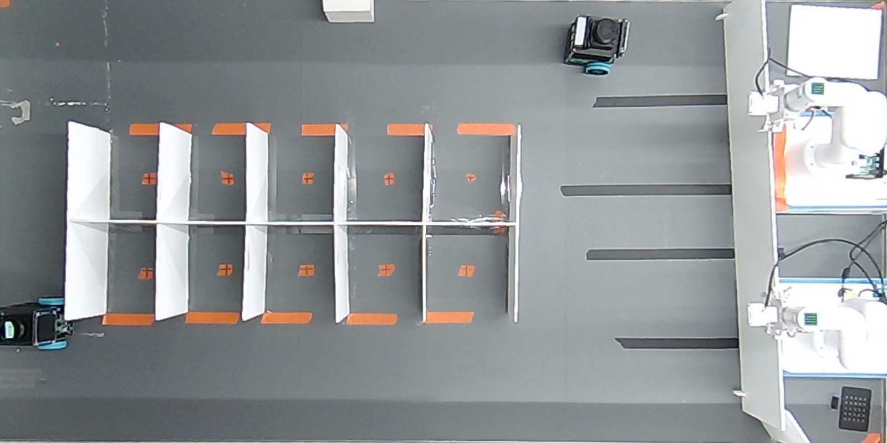
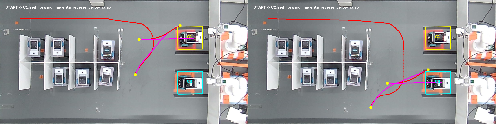
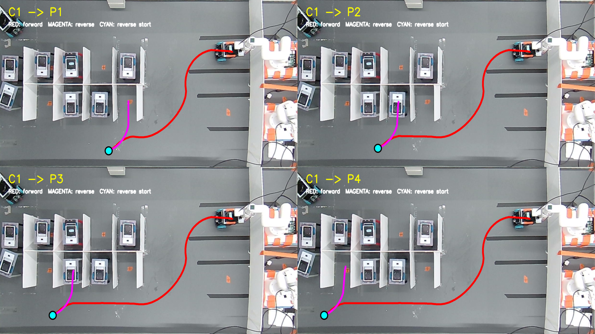

# PINKK 스마트 주차 발표 자료 — 파트별 구성

작성 기준: 2026-08-26  
발표 범위: 스마트 주차 시스템  
권장 발표 시간: 8~12분

## 발표 파트 구성

| 파트 | 핵심 역할 | 권장 시간 |
|---|---|---:|
| 0. 프로젝트 소개 | 목표와 전체 흐름 | 1분 |
| 1. 영상 인식·위치추정 | 차량 검출, 점유 판정, 차량 식별 | 2분 |
| 2. 경로 계획 | 주차면 배정, 경로 생성·검증 | 2분 |
| 3. 차량 제어 | pose 융합, MPC, 안전정지 | 2분 |
| 4. 웹·시스템 통합 | 사용자 요청, 관제, 다중 차량 통신 | 2분 |
| 5. 결과와 향후 계획 | 검증 결과, 한계, 다음 단계 | 1분 |

## 파트 0. 프로젝트 소개

### 프로젝트 목표

상단 카메라로 주차장과 여러 차량을 관측하고, 차량별 LiDAR와 odometry를
결합해 차량을 구분한 뒤, 검증된 경로와 MPC를 이용해 입차·주차·충전·출차를
수행하는 ROS 2 기반 스마트 주차 시스템을 구현하는 것이다.

### 전체 동작 순서

```text
상단 카메라로 차량과 빈자리 확인
→ 카메라 차량과 실제 vehicle ID 연결
→ 현재 운행 단계에 맞는 목표 배정
→ 32개 검증 경로 중 하나 선택
→ 카메라·odometry·LiDAR로 차량 pose 융합
→ MPC로 경로 추종
→ 웹에서 상태 확인과 입·출차 요청
```

### 핵심 수치

- 운영 차량: 2대
- 일반 주차면: 8면
- 충전면: 2면
- 검증된 mission 전이: 32개
- 경로 간격: 0.5cm
- Camera BEV: 1600×800px

### 발표 멘트

“저희 프로젝트는 차량 한 대를 움직이는 제어기만 구현한 것이 아니라, 주차장
전체 인식부터 빈자리 배정, 경로 계획, 차량 제어, 웹 관제까지 하나의 흐름으로
통합한 스마트 주차 시스템입니다.”

### 추천 화면



---

## 파트 1. 영상 인식·위치추정

### 1-1. 파트 목표

- 상단 카메라 한 대로 주차장 전체 관측
- 차량의 중심 좌표와 방향 추정
- 각 주차면의 점유 여부 판정
- 카메라에서 보이는 차량을 실제 `vehicle_1`, `vehicle_2`와 연결

### 1-2. 처리 과정

```text
USB 상단 카메라
→ 카메라 왜곡 보정
→ Homography 기반 Bird's-Eye View
→ YOLO Segmentation
→ ByteTrack 차량 추적
→ 차량 중심·yaw·주차면 점유 계산
→ namespace별 LiDAR 위치와 카메라 차량 위치 비교
→ camera track과 실제 vehicle ID 연결
→ 확인된 차량 namespace로 pose·path·trajectory 발행
```

### 1-3. Namespace 기반 다중 차량 식별 — 핵심

각 차량의 LiDAR 데이터는 처음부터 차량별 namespace가 붙은 서로 다른 토픽으로
들어온다.

```text
차량 1 LiDAR → /pinkk/vehicle_1/scan ─┐
                                      ├→ LiDAR map에서 차량별 위치 후보 계산
차량 2 LiDAR → /pinkk/vehicle_2/scan ─┘

상단 카메라 → YOLO/ByteTrack → track_7 위치, track_12 위치

vehicle_1의 LiDAR 위치 ≈ track_7의 카메라 위치
vehicle_2의 LiDAR 위치 ≈ track_12의 카메라 위치

⇒ vehicle_1 ↔ track_7
⇒ vehicle_2 ↔ track_12
```

즉, namespace 토픽을 받아서 그 토픽의 차량 ID를 이미 알고 있는 상태에서,
해당 LiDAR scan을 카메라가 검출한 각 차량 위치 주변에 지도 정합한다. LiDAR
정합 위치와 카메라 위치가 가장 잘 맞는 조합을 찾으면 그 camera track이 어느
실제 차량인지 확정할 수 있다.

식별이 확정되면 카메라에서 계산한 위치와 선택된 경로를 같은 차량 namespace로
보낸다.

```text
vehicle_1 ↔ track_7 확정
→ track_7의 카메라 위치를 /pinkk/vehicle_1/localization_pose로 발행
→ vehicle_1 경로를 /pinkk/vehicle_1/path로 발행
→ vehicle_1 제어 경로를 /pinkk/vehicle_1/trajectory로 발행

vehicle_2 ↔ track_12 확정
→ track_12의 카메라 위치를 /pinkk/vehicle_2/localization_pose로 발행
→ vehicle_2 경로를 /pinkk/vehicle_2/path로 발행
→ vehicle_2 제어 경로를 /pinkk/vehicle_2/trajectory로 발행
```

매칭은 한 번의 거리 비교만으로 확정하지 않는다.

- 각 camera track 위치 주변 ±25cm에서 LiDAR x/y/yaw를 지도에 정합
- 모든 차량과 track의 가능한 일대일 조합 비교
- 지도 정합 오차가 8cm 이하인 후보만 사용
- 1순위와 2순위 조합의 비용 차이가 1cm 이상인지 확인
- 같은 조합이 2회 연속 확인돼야 최종 확정
- scan이 1.5초보다 오래되거나 확신이 부족하면 pose와 경로를 발행하지 않음

### 1-4. 사용 기술

#### Camera BEV

- 카메라 내부 파라미터로 렌즈 왜곡 제거
- Homography로 원근 영상을 위에서 내려다본 형태로 변환
- Camera BEV 좌표를 LiDAR map 좌표로 registration
- 최종 위치 단위를 m, 기준 frame을 `lidar_map`으로 통일

#### 차량 검출과 점유 판정

- YOLO segmentation mask로 차량의 실제 외곽 형상 추출
- ByteTrack으로 프레임 사이의 임시 `track_id` 유지
- 차량 mask와 주차면 polygon의 겹침 비율로 점유 판정
- 차량 위치와 yaw에 저역통과 필터 적용
- 큰 위치 점프와 오래된 track 거부

### 1-5. 발생한 문제와 해결

| 문제 | 해결 방법 |
|---|---|
| Camera 좌표와 LiDAR 지도 방향이 다름 | Homography와 rigid registration을 분리 적용 |
| ByteTrack ID가 차량 가림 이후 바뀔 수 있음 | 차량별 LiDAR scan-map 정합으로 영속 ID 연결 |
| 낮은 confidence 차량 때문에 빈 주차면을 잘못 판단 | 점유 판정용 confidence와 제어 차량용 confidence 분리 |
| 카메라 위치가 순간적으로 튐 | EMA 필터, 점프 제한, track timeout 적용 |
| 자동 차량 식별이 불확실한 시험 상황 | `TAB`, `1`, `2` 키를 이용한 수동 차량 연결 제공 |

### 1-6. 현재 상태

- 영상 보정과 BEV 변환 구현
- YOLO segmentation과 ByteTrack 구현
- 차량 중심·방향과 주차면 점유 판정 구현
- LiDAR-camera 자동 차량 연결 로직 구현
- 현재 실차 동작 시험 기본값은 수동 차량 연결 모드

### 발표 멘트

“영상 인식 파트에서는 차량을 찾는 것뿐 아니라 그 차량이 실제 어느 차량인지
구분하는 문제를 해결했습니다. 차량 1의 LiDAR는 `/pinkk/vehicle_1/scan`, 차량
2의 LiDAR는 `/pinkk/vehicle_2/scan`으로 들어오기 때문에 scan의 실제 차량 ID는
알고 있습니다. 이 scan을 지도에 정합한 위치와 카메라 track의 위치를 비교해,
예를 들어 vehicle 1과 track 7의 위치가 일치하면 둘을 같은 차량으로 연결합니다.
연결 후에는 track 7에서 계산한 카메라 위치와 경로를 다시 vehicle 1 namespace로
발행합니다. 확신이 부족하면 어느 차량에도 pose와 경로를 보내지 않습니다.”

---

## 파트 2. 경로 계획

### 2-1. 파트 목표

- 현재 위치와 빈 주차면을 기준으로 목표 자동 배정
- 좁은 주차장에서 차량 footprint가 충돌하지 않는 경로 생성
- 전진과 후진이 섞인 주차 경로 제공
- 제어기에 전달하기 전 trajectory 안전성 검증

### 2-2. 개발 과정

```text
Grid A*
→ 차량 방향을 포함한 Hybrid A*
→ Reeds–Shepp 목표 연결
→ 차량 footprint 충돌 검사
→ 경로 smoothing과 속도 profile
→ trajectory validator
→ 실시간 운영은 검증된 고정 경로 사용
```

### 2-3. 온라인 탐색에서 고정 경로로 변경한 이유

초기에는 차량이 움직일 때마다 Hybrid A*로 경로를 탐색했다. 하지만 고정된
실내 주차장에서는 탐색 시간이 매번 다르고, 좁은 공간에서 생성 결과가 달라질
수 있었다. 실차 시연에서는 항상 같은 안전한 궤적을 재현하는 것이 중요했기
때문에 다음 구조로 변경했다.

- Hybrid A*: 지도나 주차 구조가 바뀔 때 경로 생성·진단에 사용
- 고정 mission route: 실제 운영 중 즉시 선택·발행
- validator: 경로의 충돌, 곡률, 속도, 방향 전환을 사전 검사

### 2-4. Nav2 대신 경로 생성기부터 MPC까지 직접 구현한 이유

결론부터 말하면, **Nav2를 붙여도 PINKK에 필요한 핵심 부분은 대부분 별도
plugin과 adapter로 다시 만들어야 했고, 고정된 초소형 주차장에서는 그 통합
비용보다 직접 파이프라인의 재현성과 단순성이 더 중요했기 때문**이다.

Nav2가 주차를 수행하지 못해서 제외한 것은 아니다. 요구사항과 Nav2의 기본
interface 사이의 차이를 비교한 뒤 직접 구현을 선택한 것이다.

#### 요구사항 비교

| PINKK의 요구사항 | Nav2를 적용할 때 필요한 추가 작업 | 현재 선택 |
|---|---|---|
| 상단 카메라 x/y와 차량 odom·LiDAR heading을 결합한 중앙 pose | Nav2가 사용하는 TF·odometry 구조로 변환하는 localization adapter 필요 | `fused_pose`를 MPC에 직접 입력 |
| 경로점마다 명시적인 전진 `1`·후진 `-1` 정보 | 표준 `nav_msgs/Path`에는 별도 direction 필드가 없으므로 custom message 또는 planner/controller plugin 필요 | `x, y, yaw, direction`을 그대로 전달 |
| cusp에서 완전 정지 후 다음 기어 구간 시작 | controller 동작을 PINKK 규칙에 맞추는 plugin과 상태 관리 필요 | 경로 생성기와 MPC가 동일 cusp 규칙 공유 |
| 12×10cm 차량의 중심/rear-axle offset과 휠 제한 | 차량 모델과 제약을 custom planner·controller에 재구현해야 함 | generator·validator·MPC가 하나의 모델 공유 |
| 카메라–LiDAR로 두 차량 ID를 연결하고 주차면·충전면 배정 | Nav2 외부에 별도 fleet/mission coordinator가 필요 | 중앙 관제에서 ID·mission·namespace를 함께 관리 |
| 고정된 32개 source→target 전이의 반복 시연 | 범용 온라인 탐색보다 검증 경로 선택기가 단순함 | 같은 요청에 같은 CSV를 즉시 발행 |

#### 1. Nav2를 사용해도 핵심 알고리즘은 그대로 커스텀해야 했음

PINKK의 핵심은 일반적인 한 지점 이동이 아니라 다음 연결이다.

```text
외부 상단 카메라 기반 pose
→ 명시적인 전진/후진 경로
→ cusp 정지와 gear block
→ 소형 차동구동 MPC
→ 차량별 namespace
```

이 구조를 Nav2에 넣으려면 localization adapter, custom planner 또는 경로 변환기,
custom controller plugin, 중앙 다중 차량 coordinator를 별도로 구현해야 한다.
결국 직접 만든 핵심 코드 위에 Nav2 lifecycle·action·behavior tree 계층을 하나 더
올리는 형태가 되어, 현재 범위에서는 얻는 이점보다 연결 지점과 디버깅 대상이
늘어난다고 판단했다.

#### 2. 경로의 전진·후진 의미를 생성기부터 제어기까지 보존해야 했음

PINKK는 각 경로점에 다음 정보를 저장한다.

```text
x_m, y_m, yaw_rad, direction
```

MPC는 이 `direction`을 이용해 signed speed를 정하고, 현재 gear block 안에서만
최근접점을 찾으며, cusp에서 0속도를 확인한 뒤 다음 구간으로 전환한다. 이 의미를
중간 adapter에서 다시 추론하지 않고 생성기→ROS trajectory→MPC까지 그대로
보존하는 편이 후진 주차의 오동작 가능성을 줄였다.

#### 3. 초소형 고정 주차장에서는 범용성보다 결정성과 cm 단위 검증이 중요했음

주차장은 약 2.5×2.2m 규모이고 차량은 12×10cm이며, START·주차면·충전면·EXIT가
고정되어 있다. 이런 환경에서는 범용 global replanning보다 다음이 더 중요했다.

- 같은 요청에 항상 같은 궤적 재현
- 0.5cm 간격으로 경로별 차체 충돌 여유 확인
- 출차·후진 진입 형상을 실차 결과에 맞춰 개별 보정
- 탐색 실패와 계산시간 편차 제거
- 문제가 생긴 경로 하나를 CSV 단위로 회귀 시험

따라서 사전 검증한 32개 경로를 즉시 선택하는 구조가 실제 시연의 요구와 더 잘
맞았다.

#### 4. Nav2의 자동 recovery보다 fail-closed 정지가 우선이었음

좁은 주차면에서 차량 ID나 외부 카메라 pose가 불확실할 때 임의의 회전·후진
recovery를 수행하면 벽이나 다른 차량과 접촉할 위험이 있다. 현재 프로젝트는
센서 timeout, identity 미확정, 경로 이상, 장애물 상황에서 새로운 행동을
시도하기보다 0속도로 정지하도록 설계했다. 이는 범용 이동로봇의 recovery보다
실내 정밀 주차 시연의 안전정책에 맞는다.

#### 5. 다중 차량의 핵심 문제는 Nav2 바깥에 있었음

이 프로젝트의 주요 난제는 각 차량의 개별 길찾기만이 아니었다.

- namespace별 LiDAR와 camera track의 차량 ID 연결
- 빈 주차면과 충전면 배정
- `START → 주차 → 충전 → 재주차 → EXIT` 단계 관리
- 웹 요청의 차량 검증과 출차 우선순위

이 기능은 Nav2를 도입하더라도 중앙 관제에서 별도로 구현해야 한다. 따라서
mission 결과를 검증 경로와 MPC로 바로 연결하는 구조가 전체 시스템을 더 단순하게
만들었다.

#### 직접 구현의 대가와 Nav2를 고려할 시점

이 선택이 항상 Nav2보다 우수하다는 뜻은 아니다. 직접 구현하면서 costmap,
lifecycle 관리, behavior tree, recovery behavior와 동적 장애물 우회를 자체적으로
보완해야 한다. 현재 동적 장애물은 온라인 우회가 아니라 LiDAR 안전정지로만
처리한다.

향후 주차장이 커지거나 구조가 자주 바뀌고, 알려지지 않은 목적지와 동적 우회가
필요해지면 Nav2를 기반으로 현재 MPC를 controller plugin으로 연결하는 구성이 더
유리할 수 있다.

#### 발표용 핵심 답변

> “Nav2를 단순히 배제한 것이 아닙니다. 저희 시스템은 외부 상단 카메라 pose,
> 경로점별 전진·후진 정보, cusp 완전 정지, 소형 차량의 휠·곡률 제약, 그리고
> 두 차량의 중앙 mission 배정이 핵심입니다. Nav2를 사용해도 이 부분은 custom
> adapter와 planner·controller plugin으로 다시 만들어야 했습니다. 반면 환경은
> 고정된 약 2.5m 주차장이라 범용 재탐색과 recovery보다 32개 경로의 결정성과
> cm 단위 검증이 더 중요했습니다. 그래서 핵심 파이프라인을 직접 연결했고,
> 동적 환경으로 확장할 때는 Nav2 도입을 다시 고려할 수 있습니다.”

### 2-5. 현재 고정 경로는 어떻게 생성했는가? — 핵심

현재 사용하는 32개 고정 경로는 Hybrid A*가 탐색한 결과를 그대로 CSV로 저장한
것이 아니다. 실제 주차장에 맞춰 기준 좌표를 정한 뒤, 기하학적 경로 조각을
조합하고 충돌·곡률을 검사해 만든 경로다.

#### 전체 생성 흐름

```text
1. Camera BEV와 LiDAR map 정합
2. YAML에 도로 기준점과 각 주차면 pose 입력
3. 공통 도로 centerline 생성
4. 각 주차면의 출차 connector 생성
5. 각 목표 주차면의 진입 connector·후진 maneuver 생성
6. source connector + 공통 도로 + target connector 조립
7. 차체 충돌·곡률·마지막 직선 후진 검사
8. rear-axle 기준 경로를 차량 중심 기준으로 변환
9. 0.5cm 간격 CSV로 저장
```

#### 1단계. 실제 주차장의 기준 좌표 정의

`fixed_mission_routes.yaml`에 다음 값을 `lidar_map_cm` 기준으로 기록했다.

- `START`, `EXIT`의 기준 pose
- 일반 주차면 `P1~P8`의 도로 staging과 최종 goal pose
- 충전면 `C1`, `C2`의 staging, 정렬 pose와 최종 goal pose
- 공통 도로의 `road_backbone` 기준점
- 허용되는 source→target 전이
- 구간별 회전반경과 주차 진입용 보정값

이 좌표들은 Camera BEV에서 확인한 실제 주차면과 LiDAR map registration을 기준으로
맞췄다. 따라서 경로는 이미지 pixel이 아니라 실제 지도 cm 좌표로 생성된다.

#### 2단계. 공통 도로 centerline 생성

`START → P8 → P7 → P6 → P5 → C1 → C2 → P1 → P2 → P3 → P4 → EXIT`
순서의 `road_backbone` 기준점을 연결한다.

- 기준점 사이는 직선으로 연결
- 꺾이는 모서리는 접선이 이어지는 원호로 교체
- 공통 도로 원호는 기본 반경 16cm 사용
- 넓은 상단 코너는 별도 18cm 반경 사용
- 모든 점은 0.5cm 간격으로 샘플링
- 생성 즉시 회전된 12×10cm 차량 footprint의 지도 충돌 검사

즉, waypoint를 각진 polyline으로 그대로 연결하지 않고 `직선 → 접선 원호 → 직선`
형태로 만들어 차량이 조향을 갑자기 바꾸지 않도록 했다.

#### 3단계. 주차면 진입·출차 connector 생성

공통 도로만으로는 주차면 안까지 들어갈 수 없으므로 각 endpoint에 전용 connector를
붙였다.

```text
출발 주차면 goal
→ 출발지 전용 Reeds–Shepp 전진 출차 connector
→ 공통 도로 attachment
→ 공통 centerline 주행
→ 목표 주차면 앞 attachment
→ 전진 접근·자세 정렬
→ 연속 후진 주차
→ 목표 goal
```

- `P5~P8`: 최소 14cm 반경을 지키는 전진 접근 후 단일 연속 후진
- `P1~P4`: 최소 20cm 반경의 전진 접근 후 단일 연속 후진
- `C1`, `C2`: 통로에서 후진 → 짧은 전진 정렬 → goal yaw를 유지한 44cm 직선
  후진으로 구성한 3-point 진입
- 방향 제한 Reeds–Shepp 후보 중 전진 또는 후진 조건과 footprint 충돌 검사를
  통과한 connector만 선택

여기서 Reeds–Shepp은 두 pose 사이의 짧은 연결 후보를 만드는 데 사용한다.
지도 전체 경로를 Hybrid A*로 다시 탐색하는 것은 아니다.

#### 4단계. 구간별 부드러운 연결

공통 도로의 여러 짧은 원호가 이어져 좌우 조향이 반복되는 구간은 별도의 부드러운
연결로 교체했다.

- `C1 → P1` 합류: 시작과 끝의 곡률이 0이 되는 5차 Bezier 사용
- `C2 → P1` 합류: 전진만 허용한 Reeds–Shepp 연결 사용
- `START → C1`: Camera BEV의 직선 방향을 따르는 전용 waypoint sequence 사용
- 이후 P2~P4 또는 EXIT까지는 공통 centerline의 필요한 구간을 이어 붙임

#### 5단계. source와 target에 맞춰 한 경로로 조립

각 mission은 다음 세 조각을 결합해 만든다.

```text
[출발지에서 도로로 나오는 exit connector]
                    +
[source와 target 사이의 공통 도로 구간]
                    +
[도로에서 목표로 들어가는 entry connector]
```

예시:

```text
START → C1
= START 기준점
+ START→C1 전용 도로 waypoint
+ C1 전진 접근
+ C1 후진→전진 정렬→직선 후진 maneuver

C1 → P3
= C1 goal→도로 attachment 전진 출차 connector
+ C1→P1 Bezier 연결
+ P1→P3 공통 도로
+ P3 전진 접근과 후진 주차

P6 → EXIT
= P6 goal→도로 attachment 전진 출차 connector
+ P6→EXIT 공통 도로
```

#### 6단계. 검증 후 제어용 CSV 생성

조립된 모든 pose에 대해 다음 조건을 검사한다.

- 차량 footprint가 지도 장애물과 충돌하지 않는지
- 곡률이 설정된 최소 회전반경을 위반하지 않는지
- 마지막 직선 후진 구간에서 yaw가 바뀌지 않는지
- 주차 정렬 중 차량 후미가 목표 주차면에 너무 일찍 들어가지 않는지
- 허용되지 않은 source→target 전이가 아닌지

생성과 충돌 검사는 rear axle 기준 차량 기하를 사용한다. 검증이 끝나면 rear axle
pose를 차량 중심 방향으로 4cm 이동해 MPC가 사용하는 차량 중심 경로로 변환한다.
마지막으로 다음 형식의 CSV를 저장한다.

```text
index, x_cm, y_cm, yaw_rad, direction
```

32개 CSV와 `fixed_route_manifest.csv`는 다음 명령으로 한 번에 생성한다.

```bash
.venv/bin/python \
  src/central_control/path_planning/scripts/test_fixed_mission_routes.py \
  --generate-all
```

운영 중에는 이 생성기를 실행하지 않는다. 현재 section과 목표가 정해지면 이미
검증된 해당 CSV 전체를 선택해 차량 namespace로 발행한다.

### 고정 경로 생성 발표 멘트

“현재 고정 경로는 Hybrid A* 결과를 그대로 저장한 것이 아닙니다. 먼저 실제
주차장에서 START, 주차면, 충전면과 도로 중심 좌표를 측정해 YAML에 정의했습니다.
공통 도로는 직선과 접선 원호로 만들고, 특수 구간은 Bezier나 방향 제한
Reeds–Shepp으로 연결했습니다. 마지막에 각 주차면 전용 전진 접근과 후진
maneuver를 붙인 뒤 차량 footprint 충돌과 곡률을 검사했습니다. 검증된 rear-axle
경로를 차량 중심 경로로 변환해 0.5cm 간격 CSV로 저장하고, 실시간에는 그 CSV를
선택만 합니다.”

### 2-6. 현재 mission 구조

```text
START
├─ P5~P8
│  ├─ C1 또는 C2
│  └─ EXIT
└─ C1 또는 C2
   ├─ P1~P4
   └─ EXIT

P1~P4 → EXIT
```

현재 manifest에는 출차 직행 경로를 포함해 총 32개 전이가 있다.

### 2-7. 경로 데이터

각 trajectory point는 다음 네 필드로 구성된다.

```text
x_m, y_m, yaw_rad, direction
```

- `direction = 1`: 전진
- `direction = -1`: 후진
- sampling 간격: 0.5cm
- 방향이 바뀌는 cusp에서는 반드시 정지

### 2-8. 발생한 문제와 해결

| 문제 | 해결 방법 |
|---|---|
| 온라인 Hybrid A* 결과와 시간이 일정하지 않음 | 사전 생성·검증 경로를 운영 경로로 사용 |
| 주차 진입 중 차체가 벽이나 구획에 걸림 | 회전 footprint 충돌 검사와 전용 staging pose 적용 |
| 짧은 전진·후진이 반복되어 제어가 불안정 | 가능한 주차면은 단일 연속 후진 진입으로 단순화 |
| 목표 yaw를 너무 늦게 맞춰 주차면 경계를 침범 | 진입 전에 자세를 맞추고 마지막 구간을 직선 후진으로 구성 |
| 출차 요청이 자동 배정에 밀림 | 출차 요청을 다른 배정보다 우선하고 현재 위치에서 EXIT 경로 선택 |

### 2-9. 현재 상태

- 32개 고정 mission route validator 통과
- 고정 경로 selector 회귀 검사 통과
- 실시간 route bridge 검사 통과
- 전진·후진 direction과 cusp 정보 ROS 전달 확인

### 발표 멘트

“경로 계획 파트에서는 가장 복잡한 알고리즘을 실시간으로 사용하는 것보다,
실제 환경에서 검증된 경로를 안정적으로 재현하는 방향을 선택했습니다. 32개
경로는 차량 크기, 최소 회전반경, 전후진 전환을 반영해 미리 검증했습니다.”

### 추천 화면



빨간색은 전진, 자홍색은 후진, 노란색은 방향 전환 지점이다.



---

## 파트 3. 차량 제어

### 3-1. 파트 목표

- 여러 센서의 장점을 결합해 차량의 현재 pose 생성
- 전진·후진이 섞인 경로를 부드럽게 추종
- 센서나 통신에 문제가 있으면 즉시 정지
- 차량 두 대의 제어 토픽이 서로 섞이지 않도록 분리

### 3-2. Pose 융합

| 입력 | 역할 |
|---|---|
| 상단 카메라 x/y | 절대 위치 |
| wheel odometry | 카메라 프레임 사이 상대 이동과 yaw |
| LiDAR map matching | 출발 전 절대 heading 보정 |
| 고정 경로 첫 yaw | 초기 진행 방향 prior |
| 실제 `cmd_vel` 방향 | 전진·후진 heading 판단 |

카메라 촬영과 처리 지연 동안 차량이 이동한 양은 odometry로 보상한다. pose,
odom, scan 중 하나가 timeout되거나 LiDAR 정합 점수가 나쁘면 pose를 발행하지
않는다.

### 3-3. MPC 경로 추종

차동구동 MPC는 예측 구간의 signed speed와 curvature를 SLSQP로 최적화한다.

- 위치 오차와 yaw 오차 최소화
- 목표 속도와 경로 곡률 추종
- 속도 변화와 곡률 변화 억제
- 선속도·각속도·가속도·휠 속도 제한
- 전진/후진 direction block 관리
- cusp 도착 시 정지 후 다음 gear로 전환
- 동일 경로 재발행 시 이전 progress와 warm start 유지

### 3-4. 안전정지 조건

- pose timeout
- path 또는 `path_valid` 이상
- LaserScan timeout
- 진행 방향 장애물 감지
- MPC solver 실패
- 큰 heading 오차
- 비정상 trajectory
- 예상하지 않은 `cmd_vel` publisher 존재
- 웹 긴급정지 latch 활성화

### 3-5. 발생한 문제와 해결

| 문제 | 해결 방법 |
|---|---|
| 카메라 지연으로 과거 위치를 따라감 | 카메라 지연 시간의 odometry 이동량 보상 |
| 출발 후 LiDAR heading 보정이 경로 방향을 흔듦 | 경로 시작 후 heading correction lock |
| 전진·후진 전환 부근에서 다른 구간의 점을 선택 | 현재 gear segment 안에서만 최근접점 탐색 |
| 같은 경로가 주기 재발행될 때 진행도가 초기화 | 경로 동일성 비교 후 progress 유지 |
| 곡선에서 응답이 늦거나 궤적이 흔들림 | 제어율 동기화와 곡률 관련 MPC 가중치 조정 |
| 제어 입력이나 센서가 사라져도 계속 움직일 위험 | timeout 기반 fail-closed 정지 |

### 3-6. 현재 상태

- heading fusion 회귀 검사 통과
- 전후진 MPC와 gear 전환 구현
- 긴급정지와 장애물 정지 구현
- 전체 MPC 회귀에서 전진 재합류 시나리오 한 항목 미통과
- 2cm 횡이탈 후 합류 과정에서 중심선을 약 6.2mm 초과하는 현상 튜닝 필요

### 발표 멘트

“차량 제어 파트에서는 카메라의 절대 위치와 odometry의 빠른 상대 이동을
결합했습니다. MPC는 전진과 후진을 signed speed로 처리하며, 센서 timeout이나
장애물이 발생하면 계산을 계속하는 대신 0속도를 출력합니다. 현재 기본 주행은
구현됐고, 전진 재합류 정밀도 한 항목을 추가 튜닝하고 있습니다.”

---

## 파트 4. 웹·시스템 통합

### 4-1. 파트 목표

- 관리자가 전체 주차장과 차량 상태 확인
- 사용자가 입차·출차 요청
- 두 차량을 하나의 ROS 2 시스템에서 독립 제어
- 긴급상황에서 웹을 통해 즉시 정지

### 4-2. 웹 기능

#### 관리자 웹

- 상단 카메라와 LiDAR map 영상
- 차량 현재 상태와 목표
- 배터리 상태
- 차량별 경로 요청
- 차량별 긴급정지와 해제

#### 사용자 웹

- 입차 요청
- 출차 요청
- 배터리 상태
- 검출 overlay가 없는 순수 Camera BEV 영상

### 4-3. ROS 2 통신 구조

```text
/pinkk/vehicle_1/...
/pinkk/vehicle_2/...
```

차량별 scan, odom, pose, trajectory, `cmd_vel`, battery, emergency stop을 각
namespace로 분리한다.

```text
웹 요청
→ rosbridge WebSocket
→ /pinkk/web/control
→ 중앙 경로 배정
→ 차량별 trajectory
→ 차량별 MPC
```

### 4-4. 주요 포트

| 용도 | 방식 | 포트 |
|---|---|---:|
| 관리자 웹 | HTTP | 8000 |
| 영상 스트림 | HTTP MJPEG | 8080 |
| 브라우저와 ROS 연결 | rosbridge WebSocket | 9090 |
| 사용자 시험 웹 | Flask HTTP | 5002 |
| 차량 원격 실행 | SSH/SCP | 22 |

### 4-5. 통합 과정에서 해결한 문제

| 문제 | 해결 방법 |
|---|---|
| 두 차량의 토픽과 명령이 섞일 가능성 | 차량별 namespace와 차량 registry 적용 |
| 웹에서 직접 속도를 발행하면 제어 충돌 가능 | 웹은 경로 요청만 보내고 `cmd_vel`은 MPC만 발행 |
| 오래된 경로가 남아 차량이 다시 움직일 가능성 | `path_valid=false`와 transient-local 경로 무효화 |
| 출차 요청과 자동 주차 배정이 충돌 | 출차 요청 우선순위 적용 |
| 여러 실행 프로세스의 환경과 경로가 장비마다 다름 | 저장소 기준 상대 경로와 공통 실행 스크립트 정리 |

### 4-6. 현재 상태

- 관리자 웹 구현
- 사용자 웹 시험 구현
- 차량별 배터리와 상태 표시 구현
- 입차·출차 요청 구현
- 차량별 긴급정지 service 구현
- 일반 `pause`의 완전한 중앙 중재는 미완성
- 사용자 웹은 Flask 내장 서버이므로 내부망 시험용

### 발표 멘트

“통합 파트에서는 웹이 차량 속도를 직접 제어하지 않도록 역할을 분리했습니다.
웹은 사용자의 의도를 중앙 관제에 전달하고, 중앙 관제가 올바른 차량의 namespace로
경로를 보냅니다. 실제 속도는 차량별 MPC만 발행해 제어 충돌을 막았습니다.”

---

## 파트 5. 결과와 향후 계획

### 5-1. 구현 결과

| 영역 | 상태 |
|---|---|
| Camera BEV와 차량 검출 | 구현 |
| 주차면 점유 판정 | 구현 |
| 두 차량 자동 식별 로직 | 구현, 실차 시험 기본값은 수동 fallback |
| 32개 고정 경로 | 검증 통과 |
| Pose와 heading 융합 | 회귀 검사 통과 |
| 전후진 MPC | 구현, 재합류 정밀도 1개 항목 튜닝 필요 |
| 관리자 웹과 긴급정지 | 구현 |
| 사용자 입·출차 웹 | 시험 구현 |

### 5-2. 프로젝트에서 얻은 핵심 경험

1. 좌표계가 통일되지 않으면 좋은 인식과 제어 알고리즘도 연결되지 않는다.
2. 실차에서는 센서 정확도뿐 아니라 지연과 데이터 최신성 관리가 중요하다.
3. 복잡한 온라인 계획보다 검증 가능한 경로가 고정 환경에서 더 안정적일 수 있다.
4. 전진·후진 경로는 위치뿐 아니라 gear 상태와 cusp 정지가 중요하다.
5. 인식이 불확실한 경우 움직이지 않는 fail-closed 구조가 필요하다.

### 5-3. 다음 단계

1. MPC 전진 재합류 overshoot 수정
2. 자동 차량 식별 반복 실차 검증 후 기본 모드 전환
3. 동적 장애물의 온라인 우회 기능 추가
4. 지도와 카메라 변경 시 calibration 절차 자동화
5. 중앙 `pause`와 management event 흐름 완성
6. 반복 입차·주차·출차 통합 시험과 성공률 측정

### 마무리 멘트

“현재 PINKK는 영상 인식, 경로 계획, 차량 제어, 웹 관제 파트를 하나의 ROS 2
시스템으로 연결했습니다. 32개 경로와 주요 융합 검사는 통과했으며, 앞으로는
자동 차량 식별과 MPC 정밀도를 높여 반복 가능한 완전 자율 시연을 완성할
계획입니다.”

## 파트별 예상 질문

### 영상 인식·위치추정

**Q. 차량 두 대를 어떻게 구분합니까?**  
카메라 track 주변에서 각 차량의 LaserScan을 지도에 정합하고, 일대일 조합 중
비용이 가장 낮은 연결을 선택한다. 확신 기준을 만족하지 못하면 차량을 확정하지
않는다.

**Q. 카메라가 차량을 놓치면 어떻게 됩니까?**  
track timeout과 pose timeout이 발생하며, 최신 위치를 확보할 수 없으면 차량
제어기는 정지한다.

### 경로 계획

**Q. 왜 실시간 최적 경로를 사용하지 않습니까?**  
주차장 구조가 고정돼 있고 실차에서는 매번 같은 안전한 궤적을 재현하는 것이 더
중요했기 때문이다. Hybrid A*는 새 경로 생성과 진단에 사용한다.

**Q. 왜 Nav2를 사용하지 않고 경로 생성기와 MPC를 직접 만들었습니까?**  
Nav2를 사용해도 외부 상단 카메라 pose adapter, 전후진 direction을 보존하는
planner/controller plugin, custom MPC와 다중 차량 coordinator를 별도로 만들어야
했다. 고정된 약 2.5×2.2m 주차장에서는 이 통합 계층보다 32개 경로의 결정성과
0.5cm 단위 충돌 검증이 더 중요했다. 그래서 생성기부터 MPC까지 직접 연결했으며,
동적 환경으로 확장하면 Nav2 도입을 다시 고려할 수 있다.

**Q. 고정 경로에서 장애물이 나타나면 어떻게 합니까?**  
현재는 LiDAR로 진행 방향 장애물을 감지해 정지한다. 온라인 우회는 다음 단계다.

### 차량 제어

**Q. 카메라만으로 제어하지 않는 이유는 무엇입니까?**  
카메라는 절대 위치를 제공하지만 처리 지연이 있다. odometry의 빠른 상대 이동과
LiDAR heading을 결합해 지연과 방향 오차를 보완한다.

**Q. MPC가 실패하면 어떻게 됩니까?**  
solver 실패나 입력 timeout을 감지하면 0속도를 발행한다.

### 웹·시스템 통합

**Q. 웹에서 차량을 직접 조종합니까?**  
아니다. 웹은 입차·출차 같은 경로 요청만 보내고, 속도 명령은 차량별 MPC가
계산한다.

**Q. 두 차량의 명령이 섞이지 않습니까?**  
모든 주요 토픽과 service를 `/pinkk/vehicle_1`, `/pinkk/vehicle_2` namespace로
분리하고 차량 registry에서 ID, IP, namespace 관계를 관리한다.

## 파트별 발표자 배정표

| 발표자 | 담당 파트 | 준비할 화면 |
|---|---|---|
| __________ | 프로젝트 소개 | 전체 BEV와 시스템 구조 |
| __________ | 영상 인식·위치추정 | YOLO 검출, 주차면 점유, 차량 ID |
| __________ | 경로 계획 | C1/C2 및 P1~P4 경로 이미지 |
| __________ | 차량 제어 | fused pose, MPC 시각화, 정지 조건 |
| __________ | 웹·시스템 통합 | 관리자·사용자 웹, 긴급정지 |
| __________ | 결과·마무리 | 검사 결과와 향후 계획 |
